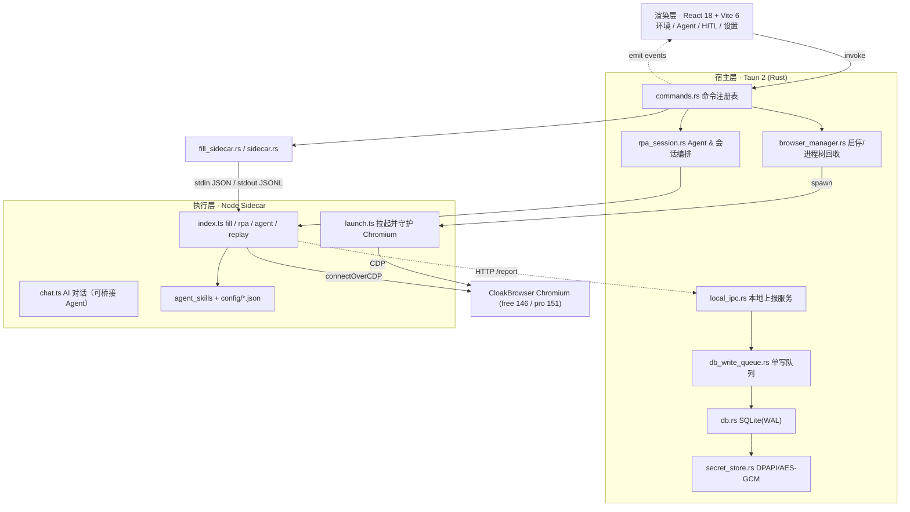

# 天枢台 (TianshuTai) · 使用手册

> **这是什么**：一台机器上的「指纹浏览器 + AI 自动化控制台」。你可以批量创建互不干扰的独立浏览器环境，注入拟人化指纹与代理出口，然后让 **AI Agent** 替你浏览、注册、填表、采集、比价、购物/订票（**停在支付前**），拿不到的东西（验证码、短信码、付款）交回给你。
>
> **你会用它做的四件事**：① 管理一批「浏览器环境」 ② 给 Agent 一句目标让它自己跑 ③ 用「规则 / 人设」告诉它什么算做完、用谁的身份 ④ 把跑过一遍的流程**录下来反复批量回放**。

| 项目 | 说明 |
| --- | --- |
| 当前版本 | `2.1.0` |
| 支持系统 | Windows 10 / 11 x64 |
| 运行方式 | 本地桌面应用，全部计算在本机完成，无需云端账号 |
| 三条绝不能破的底线 | **永不无人支付** · **不编造验证码/短信码/token** · **不为过检测改指纹** |
| 行为宪法 | 仓库根目录 [`.cursorrules`](./.cursorrules)（与本手册冲突时，以宪法为准） |
| 回放/数据集/剪贴板/外部 API 契约 | 仓库根目录 [`执行计划.md`](./执行计划.md) |

---

## 目录

- [1. 安装与启动](#1-安装与启动)
- [2. 五分钟上手](#2-五分钟上手)
- [3. 界面地图](#3-界面地图)
- [4. 环境管理](#4-环境管理)
- [5. 浏览器 Agent：让 AI 自己干活](#5-浏览器-agent让-ai-自己干活)
- [6. 规则与人设：告诉它「做到什么程度」和「用谁的身份」](#6-规则与人设告诉它做到什么程度和用谁的身份)
- [7. Ai Chat：聊天、读页、三种填表、一句话拉起 Agent](#7-ai-chat聊天读页三种填表一句话拉起-agent)
- [8. 轨迹记忆与批量回放](#8-轨迹记忆与批量回放)
- [9. 验证码与验证邮箱/短信](#9-验证码与验证邮箱短信)
- [10. 人工介入中心（HITL）](#10-人工介入中心hitl)
- [11. 设置详解](#11-设置详解)
- [12. 外部数据 API（给 Python 等程序传数据）](#12-外部数据-api给-python-等程序传数据)
- [13. 红线：它不会做什么](#13-红线它不会做什么)
- [14. 常见问题](#14-常见问题)
- [15. 数据与文件位置](#15-数据与文件位置)
- [16. 环境变量](#16-环境变量)
- [17. 构建、打包与开发（进阶）](#17-构建打包与开发进阶)
- [18. 目录结构](#18-目录结构)
- [附录 A：Agent 能用的全部工具](#附录-aagent-能用的全部工具)
- [附录 B：技能包（Skills）](#附录-b技能包skills)
- [附录 C：配置词表](#附录-c配置词表)
- [附录 D：回归测试](#附录-d回归测试)

---

## 1. 安装与启动

### 1.1 便携版（绝大多数人用这个）

1. 解压整个 `portable\` 文件夹（**不要只挑 exe 单独拿出来**）。
2. 双击 `Start-TianshuTai.bat`（或直接运行 `TianshuTai.exe`）。
3. 首次运行会自动检测依赖环境；缺件时脚本会提示。

> `TianshuTai.exe` 必须与 `sidecar\`、`Browse\` **同级同目录**，移动 exe 会导致打不开。

### 1.2 运行前需要具备

| 组件 | 要求 | 说明 |
| --- | --- | --- |
| WebView2 运行时 | 必需 | 应用界面依赖它；缺失时 `check-runtime.bat` / 启动脚本会报错 |
| Node.js | LTS（建议 20 / 22） | AI 与自动化引擎（Sidecar）需要 |
| CloakBrowser 内核 | 必需 | 便携包已自带于 `Browse\`：`chromium-146.*`（免费核）、`chromium-151.*-pro`（Pro 指纹核） |

一次性自检：运行 `scripts\check-runtime.bat`，它会逐项检查 Node / WebView2 / Sidecar / 主程序 / 内核 / 授权。
首次使用的环境套装安装可运行 `scripts\Setup-TianshuTai.bat`。

### 1.3 内核与授权（免费 vs Pro）

- **免费核 `146.*`**：可跑 **AI / Agent / 智能填表**；**同时只能开 1 个指纹窗口、AI 并行 1 路**。
- **Pro 指纹核 `151.*`**：免费授权下**仅能指纹浏览**，AI / Agent / 填表会被拦截并给出可读提示；购买 Pro 后解除。
- 想用 Pro 核：在「**设置 → 浏览器 → 浏览器内核密钥**」粘贴订阅邮件里 `cb_` 开头的密钥并「保存并验证」；也可点「导入 Key 文件」选 `.tsk` 文件。
- 应用启动环境时会**优先使用** `Browse\` 下的本地内核，无需联网下载。

### 1.4 源码运行 / 开发（可选）

```powershell
.\install-build-deps.bat   # 安装/检测 Node、Rust、VS C++、WebView2
.\start-app.bat            # 开发模式：装依赖 → 构建 Sidecar → tauri dev
.\build-app.bat            # 打包便携版 → release-dist\portable
```

细节见 [§17 构建、打包与开发](#17-构建打包与开发进阶)。

---

## 2. 五分钟上手

按顺序走一遍，就能跑通第一个自动化任务：

1. **配好 AI**：右上角齿轮 →「AI」→ 选服务商（DeepSeek / 智谱 / 自定义）→ 填 API Key → 点「测试连接」看到「已连接」。
2. **建一个环境**：顶栏点「新建」→ 填名称（如 `TikTok_US_01`）→ 选一个内核 →（可选）绑定代理 → 点「创建环境」。
3. **启动环境**：在列表里点该行的 ▶，状态变成「● 运行中」即成功（首屏会自动打开 `browserscan.net` 作为指纹自检页）。
4. **让 Agent 干一件事**：右栏「Agent」Tab → 目标输入框写一句，例如
   `打开百度搜索今天的天气，把结果念给我` → 点「启动」。
5. **看它怎么干**：上方「监视日志」会实时滚出思考 / 观察 / 动作卡片；需要你确认或提供信息时，**左下角「介入收件箱」**会亮起（见 [§10](#10-人工介入中心hitl)）。
6. **想复用？** 启动前勾上「录制轨迹」，成功跑完后到「轨迹记忆」Tab 就能看到这条流程，并可反复回放 / 批量回放（见 [§8](#8-轨迹记忆与批量回放)）。

> 小提示：**没有绑代理也能跑**，只是出口是本机 IP；想更接近真实用户，在环境里绑一个代理，应用会自动把时区 / 语言 / 经纬度对齐到出口城市。

---

## 3. 界面地图

```
┌─ 顶栏：新建 · 批量 · 刷新 · 主题 · 设置 · 窗口控制 ─────────────┐
├──────────────┬───────────────────────────────────────────────┤
│ 环境列表      │  右栏抽屉（4 个 Tab）                          │
│ · 勾选/单选   │  ① Agent       浏览器 Agent：目标 + 监视日志     │
│ · ▶ 启动 ■ 停止│  ② Ai Chat     聊天 + 采集结果 + 底部填表        │
│ · ✏ 编辑 ⋯ 更多│  ③ 运行历史    每次任务的摘要/用量/失败分类     │
│ · 批量工具条  │  ④ 轨迹记忆    轨迹库 / 沙盘回放 / 控件记忆      │
├──────────────┴───────────────────────────────────────────────┤
│ 左下角常驻：介入收件箱（所有需要你出手的事都汇到这里）           │
└──────────────────────────────────────────────────────────────┘
```

- **设置**（右上齿轮）四个 Tab：**AI** · **验证码与邮箱** · **浏览器** · **代理**。
- 右栏顶部四个 Tab 的准确名称：**Agent**（悬浮提示「浏览器 Agent」）、**Ai Chat**、**运行历史**、**轨迹记忆**。
- 左右栏宽度可拖动（默认 520px，最小 380px）。

---

## 4. 环境管理

「环境」= 一个独立的浏览器身份：独立 `userDataDir`、独立 CDP 端口、独立代理、独立指纹种子。

### 4.1 新建环境

| 字段 | 怎么填 | 举例 |
| --- | --- | --- |
| 环境名称 | 必填 | `TikTok_US_01` |
| 列表色标 | 9+ 色任选，仅用于列表区分 | 选紫色 |
| 绑定代理 | 三选一：不使用 / 代理池 / 自定义 | 选「代理池」→ 挑 `#3 · HTTP` |
| 自定义代理 | `host:port` 或 `host:port:user:pass`；**必须先点「测试代理」通过才能保存** | `us.novproxy.io:1000:user:pass` |
| 启动开页 | 第 1 页固定为 `browserscan.net`（不可改）；可再加网址，**上限 20 条** | 加 `https://mail.google.com` |
| 内核版本 | 选本地内核或自定义 pin（留空=最新） | `146.0.7680.177.5` |
| 指纹种子 Seed | **5 位数字，10000–99999**，或点「随机生成」 | `48213` |
| 防护预设 / WebGL 指纹 | 高级区内的防护档位与 WebGL 模式 | 选 `default` / `local` |

### 4.2 编辑 / 删除

- 行内 **✏** 编辑；**⋯ → 删除**（不可撤销，需二次确认）。
- **运行中的环境不能删除**（按钮会禁用并提示）。
- 批量：勾选多行后，底部出现「**批量启动**」「**批量删除**」；批量删除会**自动跳过运行中的环境**并列出行号。

### 4.3 启动 / 停止

- **▶ 启动**：拉起 CloakBrowser、预留 CDP 端口、注入代理与指纹；启动中按钮显示「启动中」。
- **■ 停止**：先停引擎再关浏览器，进程树一并回收，不留僵尸进程。
- **全部停止**：「设置 → 浏览器 → 席位占满时点『结束全部浏览器』」。

### 4.4 代理与地理一致性

- 支持 HTTP / SOCKS5 / **动态 API 提取代理**；代理密码加密存储（见 [§15](#15-数据与文件位置)）。
- 启动时若绑定了代理，应用会解析**出口 IP**，并把时区 / 语言 / 经纬度对齐到该城市（GeoIP 同步）；填表用的地址、电话也会要求与出口同城。
- 代理池管理在「设置 → 代理」，五种模式：列表、添加、批量导入、按端口段生成、从 API 拉取。
  - 批量导入：每行 `IP:Port:Username:Password`
  - 按端口段生成：同一主机 + 起始/结束端口，**单次上限 500 条**
  - 从 API 拉取：保存提取链接 + 协议 + 国家地区
- 代理连通性测试在**新建/编辑环境**的自定义代理处（不在代理池页）。

### 4.5 Cookie 导入 / 导出

| 操作 | 位置 | 行为 |
| --- | --- | --- |
| 导出 Cookie | 行内 **⋯ → 导出 Cookie** | **仅运行中可用**；导出 JSON 到下载目录并打开 |
| 导入 Cookie | 行内 **⋯ → 导入 Cookie** | 支持 `.json / .txt / .cookies`；运行中**即时注入**，未运行则**暂存**，下次启动自动注入 |

### 4.6 元素提取测试窗（调试用）

行内 **⋯ → 元素提取测试窗** 打开一个浮动窗口，可点 ↻ 让当前页**立即重新提取**，并在三个视图间切换：`Agent llm_json` / `填表提取` / `完整包`，可复制 JSON。

> 注意：**元素提取与全景截图是恒开的，没有产品开关**。列表里没有「元素提取」「全景截图」列是正常的。任何「请先开启元素提取」的提示都是错误的，遇到请按真实报错排查。

---

## 5. 浏览器 Agent：让 AI 自己干活

右栏第一个 Tab。给它一句话，它会自己观察页面 → 规划 → 操作 → 校验，直到完成或需要你介入。

### 5.1 写目标

- **广播**：不点名时，任务派发给「**已勾选且正在运行**」的环境。
  例：勾选 #2 → 填 `打开百度搜索今天的天气，把结果念给我` → 启动。
- **点名分派**：用 `#2` / `环境2` 前缀，把不同任务派给不同环境。
  例：`#2 帮我注册一个 Reddit 账号 #5 打开京东搜索机械键盘`。
- 只放附件、不写目标也能启动（会使用兜底目标）。
- 空目标且无附件会提示「请填写 Agent 目标」。

### 5.2 `@人设` / `@规则`（唯一生效开关）

在目标输入框任意位置输入 `@`，会弹出候选菜单（人设 + 规则，最多 8 条；↑↓ 选择、Enter/Tab 插入、Esc 关闭）。

- 例：`@美国中年男A 帮我注册一个 Reddit 账号，@注册成功 出现 提交成功 才算完成`
- 插入后，输入框下方会显示「已引用 · 人设「美国中年男A」· 条件「注册成功」」。

> **重点**：不写 `@` 时，**完全不查规则库、不套人设**（必填项由 AI 现生成）。`@` 是唯一开关，不是「保存了就生效」。详见 [§6](#6-规则与人设告诉它做到什么程度和用谁的身份)。

### 5.3 附件

- 点回形针选择，或直接在输入框粘贴截图 / 文本。
- 图片 → 交给视觉模型理解；文本 → 作为参考资料摘要。
- 上限：**共 6 个**；图片 **≤2MB**；文本 **≤120KB**（超出截断）。
- **红线**：附件图**不会**被当作短信/邮箱验证码来源。

### 5.4 启动 / 暂停 / 继续 / 中止

| 按钮 | 行为 |
| --- | --- |
| **启动** | 按路由派发目标并拉起 Agent；运行时按钮变「运行中…」 |
| **暂停** | **软闸**：当前步结束后挂起，不中止任务 |
| **继续** | 从观察步恢复，并**强制重新观察**（不带旧动作盲跑） |
| **中止** | **硬停** Agent，清忙闲与暂停态 |

### 5.5 看它怎么干

- **监视日志 / 思维链**：思考、观察、动作、告警、成功/失败以卡片呈现；标题栏可切「简洁 / 完整」、复制日志、开关自动滚动、清空。切换左侧环境时日志按环境隔离。
- **打开标签只读条**：显示 Agent 开了哪些标签（`1 / 2 active / 3`），点「切到前台」把该环境浏览器窗口提到最前。**不能在这里切标签**，切页由 Agent 自己决定。
- **录制轨迹**（默认开）：成功结束时把流程写入「轨迹记忆」，供以后回放；不勾选只保存运行摘要。

### 5.6 步数保险丝

`maxSteps` 默认 **200**、硬顶 **400**，是**防死循环的保险丝，不是完成配额**——它不会因为「步数过半」就催收尾。

---

## 6. 规则与人设：告诉它「做到什么程度」和「用谁的身份」

在 Agent Tab 底部点「**规则**」按钮打开（按钮角标只显示**本次输入框里 @到的规则条数**）。窗口分两栏：**规则** / **人设**。

### 6.1 规则：7 种作用

| 作用 | 含义 | 填写样例 |
| --- | --- | --- |
| **完成条件** | 什么算做完；可开「严格校验」「命中即完成」 | 见下方示例 |
| **详细步骤** | 有序多步流程，每步可配判据并自动推进（单规则 ≤20 步） | 步1「打开注册页」判据 `#signup-form`；步2「填邮箱」判据文本 |
| **中途检查点** | 阶段达成记录 / 巡检，命中只记进度不结束 | 「验证码通过」记一次 |
| **难点提醒** | 提醒文字并入提示词 | 「这步会出现滑块，失败三次请人工接管」 |
| **人工介入时机** | 命中即弹介入中心（选「拒绝」会中止任务） | 「出现身份验证」 |
| **必须点击** | 核对点击台账，没点过就拦收尾 | 「必须点过『同意条款』」 |
| **固定数据** | 钉死某输入框的值，被改写就不许收尾 | 选择器 `#email`，值 `us-buyer@example.com` |

**判据（判定方式）有三种**：

- **代码 / 选择器**：填 CSS 选择器，只判断元素是否存在/可见（例：`#register-success`）。
- **页面文本包含**：填文本（例：`提交成功`），可选「整页找」或「只在某选择器的子树里找」。
- **界面图片**：上传参考图由视觉模型比对（原图 ≤4MB，压缩后 ≤1.4M 字符），并可写对照说明。

**两个开关**：

- **严格校验（strict）**：AI 说完成时，系统按你给的选择器/文本/参考图**机器再核对一次**，不通过就不放行。
- **命中即完成（autoComplete）**：AI 没说完成，只要条件命中就由主循环收尾。

> **规则示例**：规则名 `注册成功`、作用「完成条件」、判定方式「页面文本包含」、文本 `提交成功`、勾上「严格校验」。然后在 Agent 目标里写 `@注册成功`。

> 安全说明：规则里的「代码」**只做选择器与文本匹配，绝不会被执行**；规则命中**也不能越过支付与一次性凭证红线**。

| 字段 | 说明 |
| --- | --- |
| 规则名称 | 列表名 + `@规则名` 的引用名（重名会自动加序号） |
| 补充说明 | 提醒 / 流程总说明正文 |
| 批量删除 | 勾选后一次删除（不可撤销） |
| 不生效诊断黄条 | 「先说后跑」：被截断 / 降级 / 丢弃时提前提示你 |

### 6.2 人设：字段级「固定」

人设存在规则窗口的「**人设**」栏，可存无限多条，**不绑定任何环境**。

| 字段 | 样例 |
| --- | --- |
| 条目名称 | `美国-中年男A`（就是 `@条目名` 里的名字） |
| 姓名 / 性别 / 生日 | `James Miller` / 男 / `1985/03/12` |
| 邮箱 / 电话 | `james.miller85@example.com` / `+1 415 555 0132` |
| 邮编 / 街道 / 城市 / 省州 / 国家 | `94107` / `1 Market St` / `San Francisco` / `California` / `United States` |
| **字段级「固定」勾选** | 勾上的字段在被 `@` 引用时是**权威值，AI 不得改写**；没勾的必填项由 AI 现生成 |

- 可点「全选固定」「取消全部固定」。
- **冲突提示**：人设地址/电话与代理出口 GeoIP 不一致时会红字告警（例如出口是美国却填中国城市）。
- 从未配置过「固定」的旧人设 = 默认固定「已填写的字段」，避免 @ 引用后又被 AI 另造一套。

### 6.3 在回放里用

- 回放目标里写 `@人设名` → 用该人设**整套字段**展开 `{{persona.*}}`（不受「固定」勾选限制）。
- 回放目标里写 `@规则名` → 机械步跑完后按规则**硬校验**收尾。
- 没写 `@` 时 `{{persona.*}}` 保持原样，不会静默套用。

---

## 7. Ai Chat：聊天、读页、三种填表、一句话拉起 Agent

右栏第二个 Tab。

### 7.1 聊天

- 多轮上下文对话；`Enter` 发送、`Shift+Enter` 换行；自动滚动。
- 例：`把上面采集的 20 条商品按价格从低到高整理成表格`。

### 7.2 附件

与 Agent 输入框同一套：图片 → 视觉理解，文本 → 摘要；**共 6 个，图 ≤2MB，文 ≤120KB**；支持直接粘贴。**附件不会用于自动取验证码/短信码。**

### 7.3 快捷命令

点闪电图标选择：「总结当前页」「提取表单 JSON」「风控字段排查」；也可把当前输入内容点「增加」存为自定义命令（存本机，可删）。

### 7.4 采集结果面板

当 Agent 或 Chat 采集到数据时，Ai Chat **顶部**会自动出现采集面板：显示条数 / 类型 / 来源网址，可在「表格 / JSON」间切换、预览前 8 条、**导出 CSV**、打开文件目录、关闭面板。

> 采集结果**在 Ai Chat 里就能看到**，不需要被强制切到别的 Tab。

### 7.5 底部三种填表（默认折叠）

点「填表工具」展开；三个按钮：

| 按钮 | 做什么 | 例子 |
| --- | --- | --- |
| **直接填表** | 按 `name/id/label` 启发式把 JSON 键值直接映射到页面字段，不做 AI 推演 | 粘 `{"email":"a@b.com","password":"Xx123456!"}` → 点「直接填」 |
| **智能填表** | 读上方聊天框的自然语言，结合页面元素智能补全并填 | 写 `用张三、13800000000、北京市朝阳区填写收货信息` → 点「智能填」 |
| **AI 混合填表** | 先 AI 推演 → 生成预览 → 人工确认 → 执行 | 粘 JSON → 点「混合填」→ 核对预览 → 确认并开始填表 |

配套开关（默认值）：

| 开关 | 默认 | 作用 |
| --- | --- | --- |
| 跳过推演 | 关 | 勾上则跳过 AI 推演，纯执行既定动作/JSON |
| 填前确认 | **开** | 执行前弹 JSON 预览让你核对/编辑（关掉则直接执行） |
| 填完回车 | 关 | 填完后自动按回车 |

> **互斥**：填表进行中聊天输入框会禁用（提示「填表进行中，请稍候…」）；同一环境内 Agent / 填表 / 回放也互斥。

### 7.6 一句话拉起 Agent（桥接）

在 Ai Chat 里直接说「去浏览器里做某事」，它会识别为自主任务并**拉起现有的 Agent**（不会另起一套循环），并把本次聊天附件一并转交；任务结束后把结论回写到对话里。

例：说 `帮我上京东搜索机械键盘并把前 5 个型号整理出来`。

---

## 8. 轨迹记忆与批量回放

右栏第四个 Tab。这里管「跑过一次的流程」，也是批量作业的主力。

### 8.1 从哪来

只有**勾选了「录制轨迹」并成功结束**的 Agent 任务才会写入轨迹库。列表里每条显示域名、步数、目标、逐步动作明细、文件名与时间；当前网站的相同域名轨迹会「同站置顶」并高亮。

### 8.2 单条轨迹回放

选中一条轨迹 → 点「**执行**」：**脚本优先**（零 Token 机械执行），只有目标含「总结 / 分析 / 提取」等交付词时才让 AI 读页交付。运行中按钮变「停止」。

- 轨迹里若含**支付、卡号、转账、删号、改密**等步骤：回放会**停在人工确认**，绝不无人支付（R1）。
- 目标里可继续写 `@人设名` / `@规则名`（与 Agent 同一套口径）。

### 8.3 多环境批量沙盘

选中轨迹 → 点「**沙盘**」，打开「多环境数据沙盘」。

| 区块 | 说明 / 例子 |
| --- | --- |
| 目标环境 | 勾选要派发的**运行中**环境（未运行/忙的不可选） |
| 运行次数 | 每环境跑几轮（1–100）。2 环境 × 3 轮 = **共 6 次** |
| 每轮新标签 | 默认每轮在新标签操作；单环境**上限 20 个**，触顶会回收最旧的回放标签（不静默） |
| 回放目标 / 指令 | **可编辑**；点「@ 人设 / 规则」插入引用 |
| 数据源 | 二选一：**数据集**（粘贴/上传）或**剪贴板快照**（开局读一次系统剪贴板） |
| 分配策略 | 见下表 |
| 数据不足时 | 必须显式选：报错不开跑（默认）/ 循环取用 / 生成补齐 |
| 字段编辑 | 逐字段设「固定值」或「AI 自动生成（AI 盲盒）」，可「全部固定」「全部盲盒」「AI 造数」 |
| 并发 / 失败策略 | 并发上限、错峰毫秒；可勾「该环境某轮失败即停（不影响其它环境）」 |

**五种分配策略**（默认「按序平分」）：

| 策略 | 含义 | 例子（2 环境 3 轮） |
| --- | --- | --- |
| **seq_interleave** 按序平分 | 同时开跑的浏览器拿相邻行 | A 拿行 1/3/5，B 拿行 2/4/6 |
| **seq_block** 每台连续区块 | 每台连续一段 | A 拿 0–5，B 拿 6–11 |
| **claim** 先到先领 | 谁先空谁领下一行 | 台账原子领取，可复现 |
| **cycle** 循环取用 | 行不够时循环并标记 `reused` | 2 行跑 4 次 → 第 3、4 次复用 1、2 行 |
| **generate** 全部生成 | 无数据集，值现场生成 | 唯一性由分配器发 `uniqueId` 兜底 |

### 8.4 数据集

支持 **JSON / JSONL / CSV / TSV / TXT / 剪贴板**，自动识别；可拖拽文件（**≤1MB**）或点「生成 JSON」按轨迹字段生成骨架。

- 上限：**2000 行**、单值 **4096 字符**。
- 解析失败会报「**第几行第几列**」并**禁止启动**，不会半解析就开跑。
- 「变量值表」可展开逐格改值（前 20 行）。
- **字段映射**：把数据集列绑到轨迹里的字段（`#email` → 列「邮箱」）；支持自动映射（录制值命中 → 精确 → 包含 → 相似度 → 单列兜底）。
- **未映射黄条**：载入数据却没做映射时会提示「本轮不会替换任何字段」，防止「以为换了值、其实没生效」。

### 8.5 预检单（执行前的确认表）

点「**生成预检单**」：**只算分配与风险，不启动任何页面**。表格逐行列出「环境 / 第几轮 / 用哪一行数据 / 关键字段预览 / 标签策略」，并给出：

- **红条（禁止启动）**：环境未运行、环境忙、数据集列名命中一次性凭证词表（R2）、数据行不足、行号越界。
- **黄条（可见不拦）**：数据行被多轮共用、标签超限、数据集未映射、数据集用不完、**轨迹含 critical 步骤（会停在人工确认）**。

**planHash（防「跑的和你确认的不是一份」）**：数据集有 `dataset_hash`、整张执行表有 `planHash`。你改了运行次数 / 数据 / 跳过 / 标签 / 并发，旧预检单立刻失效（界面提示重新生成）；启动前会再校一次，不一致就拒绝启动（外部 API 返回 `409 plan_stale`），**一个页面都不会开**。

### 8.6 启动与停止

- 「**确认并启动**」按预检单逐行派发，并发按你设的上限；启动后沙盘自动关闭，进度看列表「停止」与回放日志。
- 「**停止派发**」向所有在跑环境发中止。
- 回放日志是独立终端区（可拖高，96–420px，记住高度）。

### 8.7 运行历史（第三个 Tab）

- 每条任务显示状态 + 环境 + 步数 + 域名 + token + 估算费用 + 目标 + 时间；
- 本机合计看板：已结束数、Token、估算费用、失败分类（找不到目标 / 超时 / 动作失败等）；
- 展开可看结果、用量、失败次数，并「打开关联轨迹」跳到轨迹记忆；
- 可删除单条或批量删除（**不影响已保存的轨迹文件**）。
- **运行摘要始终保存**，与是否勾选「录制轨迹」无关。

### 8.8 控制记忆

Agent 成功操作过的控件会记下「意图 → 选择器/坐标」，用于下次更快命中。可在轨迹记忆面板内展开查看，按「当前站 / 全部」切换，或清空（只删控件记忆，不动轨迹与模板）。

### 8.9 可用的魔法变量

| 类别 | 变量 |
| --- | --- |
| 人设 | `{{persona.name}}` `{{persona.email}}` `{{persona.phone}}` `{{persona.city}}` `{{persona.postalCode}}` |
| 出口地理 | `{{geoip.city}}` `{{geoip.region}}` `{{geoip.country}}` `{{geoip.countryCode}}` `{{geoip.exitIp}}` |
| 轮次身份 | `{{run.seq}}` `{{run.index}}` `{{run.envId}}` `{{run.jobId}}` `{{run.uniqueId}}` `{{run.uniqueHex}}` |
| 数据集 | `{{data.列名}}` |
| 剪贴板 | `{{clip.0}}`（第 1 次剪贴板读取内容） |

例：`{{run.uniqueId}}@test.com` → 第 1 轮 `0@test.com`，第 2 轮 `1@test.com`（由分配器按序发号，可复现，**不靠随机**）。

---

## 9. 验证码与验证邮箱/短信

### 9.1 三层策略

```
Layer 1｜内置可自动过：图形文字码 · 滑块缺口 · 点选验证 · 算式图 · 长按按钮
Layer 2｜可委托通道（须已配置）：邮箱 OTP（IMAP/临时邮）· token 挑战（第三方 solver）· 显式启用的短信/网页邮箱
Layer 3｜人工确认：短信 / TOTP / 通道未配置或失败 / 支付等 critical
```

- Layer 1 失败满阈值（默认 **3 次**）自动升 Layer 3。
- **critical（支付 / 转账 / 删号 / 改密）永远 Layer 3，不进 Layer 2。**
- **禁止编造**短信码 / TOTP / Turnstile / reCAPTCHA token；未配置就升人工，不猜。

### 9.2 在哪配

「设置 → **验证码与邮箱**」：

| 区块 | 关键项 |
| --- | --- |
| 邮箱验证码通道 | 生效范围（全局默认 / 指定环境）；通道类型（未配置 / **IMAP** / **临时邮 API** / 网页邮箱-非默认）；IMAP 主机·端口(993)·用户名·文件夹(INBOX)·TLS；临时邮服务商（MailSlurp 需 Key / 1secmail 免 Key）与收件地址；网页邮箱需勾「显式启用」 |
| 短信接码平台 | 默认**关**；开启后填服务商（SMS-Activate / 5sim）、激活/订单 ID、API Key |
| 图形验证码 | 只读展示内置 5 类能力；可启用**第三方验证码服务**（填服务商 ID + API Key，如 `2captcha` / `capsolver`）用于 Turnstile / reCAPTCHA 等 token 挑战 |

- 密钥走加密存储；个环境可单独绑定邮箱通道（环境优先于全局）。
- 每块都有「测试连接 / 保存 / 清除」。
- **一次性码用完即弃**：不写 `results.md`、不进轨迹明文、不进控制记忆。

### 9.3 网页邮箱为什么不是默认

Gmail / QQ / Outlook 网页翻信**仅作显式启用的非默认适配器**（R5）：默认必须是 IMAP 或临时邮 API，避免「偷偷去翻你的邮箱」。

---

## 10. 人工介入中心（HITL）

**左下角常驻的「介入收件箱」是唯一入口**，切换 Tab 也不会消失。所有需要你出手的事都汇到这一处。

### 三种介入类型

| 类型 | 什么时候出现 | 你看到什么 | 你能做什么 |
| --- | --- | --- | --- |
| **确认（confirm）** | 即将执行 critical（支付/转账/删除/发布）或 sensitive（提交/注册/登录）动作；或填写置信度低 | 动作清单（`fill` 行可当场改值，`click` 行只读） | 「确认并执行」/「取消」 |
| **问答（ask）** | 需要你提供信息：短信码、邮箱码、TOTP、证件号等 | 一个输入框（占位「短信 / 邮箱验证码或其他信息…」） | 填好点「发送给 Agent」 |
| **接管（handover）** | 验证码满 3 次失败、风控、连续失败 | 卡片带**介入时页面截图缩略图** | 「去处理」/「恢复执行」/「中止」 |

- **去处理**：把该环境浏览器窗口提到前台，你手动处理（例：手动过验证码）。
- **恢复执行**：处理完点它，Agent 会**重新观察**再继续。
- **取消（confirm）**：视为动作失败（`denied-by-user`）；**同一支付动作不允许换个说法重试**。

### 贴心处理

- **同站同任务合并**：同一网站同一任务的多个环境合成一张卡片（标题会写明合并了几个环境）。
- **连续确认合并**：同一环境连续的字段确认合并成一次整批核对。
- **任务结束自动出队**；点卡片「×」只把它移出收件箱，**不会中止 Agent**。

---

## 11. 设置详解

右上齿轮打开「设置」，四个 Tab。

### 11.1 AI

| 项 | 说明 |
| --- | --- |
| 服务商 | DeepSeek / 智谱 BigModel / 自定义；切换会自动带出对应 Base URL |
| API Base URL | 自定义服务商地址（失焦自动保存） |
| API Key | 按服务商分开存储（输入后自动保存） |
| 连通性 | 点「测试连接」显示「已连接 / 未连接」 |
| 模型库 | 手动添加模型 ID；可标记「支持视觉」「强制禁用思考」 |
| 按任务选模型 | **极速(chat) / 深度(agent) / 视觉(vision)** 三档；留空时视觉沿用文本档、极速与深度互相补位 |

> 未配置任何 Key 时，Ai Chat 退化为本地离线回复；纯 RPA / 直接填表仍可用。

### 11.2 验证码与邮箱

见 [§9.2](#92-在哪配)。

### 11.3 浏览器（常规设置）

| 区块 | 内容 |
| --- | --- |
| 浏览器内核 | 状态摘要（已就绪版本 / 席位 / 可清理数）；**默认版本**选择；本机已安装列表（可「设为默认」「使用中」）；**下载 / 检查更新 / 清理旧版 / 诊断**；「结束全部浏览器」 |
| 浏览器内核密钥 | License Key 输入 + **保存并验证**；**导入 Key 文件（.tsk）**；**仅验证文件**；**清除 License** |
| 存储与下载 | **常规浏览器下载目录**、**采集数据抓取目录**；「清理缓存」 |
| 外部数据 API | 见 [§12](#12-外部数据-api给-python-等程序传数据) |
| 高级 · 兼容与调试 | 授权检查走代理、允许第三方 Cookie、**关闭指纹伪装（危险，会二次确认并在列表高亮警示）** |

### 11.4 代理

见 [§4.4](#44-代理与地理一致性)。

---

## 12. 外部数据 API（给 Python 等程序传数据）

用途：让本机上的外部程序（Python 脚本、爬虫、Excel 宏…）**只传数据**、不传命令，让应用替你执行填表 / 回放。

**默认关闭**，需在「设置 → 浏览器 → 外部数据 API」显式开启；回放族与剪贴板族还各有**独立开关**（默认关）。

### 12.1 安全模型

- 只监听 `127.0.0.1` 随机端口；校验 `Host` 必须为回环（防 DNS 重绑定）；对端必须回环。
- **独立令牌**（`X-Api-Token`，兼容 `X-Auth-Token` / `Authorization: Bearer`），可随时「重新生成」（旧令牌立即失效）。只有 `/v1/health` 免鉴权。
- 请求体严格解析：**拒绝** `actions / command / script / selector / url / click / evaluate` 等命令键；出现即 `400`。
- 限额：body 256KB、单次 **≤64 字段**、单值 **≤4096 字符**。

### 12.2 端点

| 方法 | 路径 | 开关 | 作用 |
| --- | --- | --- | --- |
| GET | `/v1/health` | 免鉴权 | 探活 |
| GET | `/v1/meta` | 总开关 | 环境列表 + 限额 + 红线说明 |
| POST | `/v1/fill` | 总开关 | **唯一写入字段值**的接口（只传数据） |
| GET | `/v1/replay/meta` | 总开关 | 轨迹列表 + 限额 + 分配模式说明 |
| POST | `/v1/replay/plan` | **回放开关** | 干跑出预检单（不碰浏览器） |
| POST | `/v1/replay` | **回放开关** | 按 `planHash` 触发回放（`202`） |
| GET | `/v1/replay/{jobId}` | 总开关 | 任务状态 + 每环境进度 |
| POST | `/v1/replay/{jobId}/cancel` | 总开关 | 取消剩余轮次并中止在跑轮次 |
| GET | `/v1/clipboard` | **剪贴板开关** | 只读系统剪贴板文本（不入库） |

### 12.3 例子

填表（环境必须已在运行）：

```bash
curl -s -X POST "http://127.0.0.1:54321/v1/fill" \
  -H "X-Api-Token: $TOKEN" -H "Content-Type: application/json" \
  -d '{"profileId":"7","fields":[{"name":"email","value":"a@b.com"},{"name":"姓名","value":"张三"}]}'
```

回放（两段式：先干跑拿 `planHash`，再按 hash 执行）：

```bash
# 1) 干跑预检单（不启动浏览器）
curl -s -X POST http://127.0.0.1:54321/v1/replay/plan -H "X-Api-Token: $TOKEN" \
  -H "Content-Type: application/json" \
  -d '{"trajectoryId":42,"profileIds":["3","5"],"repeatCount":10,
       "dataset":{"format":"json","inline":[{"email":"u{{run.uniqueId}}@b.com"}]},
       "allocation":{"mode":"seq_interleave","onExhausted":"error"}}'
# → 200 { planHash:"sha256:1a2b…", rows:[…], warnings:[…], errors:[] }

# 2) 按 planHash 执行（202；hash 不符 → 409 plan_stale，不开任何页面）
curl -s -X POST http://127.0.0.1:54321/v1/replay -H "X-Api-Token: $TOKEN" \
  -H "Content-Type: application/json" \
  -d '{"trajectoryId":42,"profileIds":["3","5"],"repeatCount":10,
       "dataset":{"format":"json","inline":[{"email":"a@b.com"}]},
       "allocation":{"mode":"seq_interleave","onExhausted":"error"},
       "planHash":"sha256:1a2b…"}'

# 3) 轮询 / 取消
curl -s -H "X-Api-Token: $TOKEN" http://127.0.0.1:54321/v1/replay/<jobId>
curl -s -X POST -H "X-Api-Token: $TOKEN" http://127.0.0.1:54321/v1/replay/<jobId>/cancel
```

### 12.4 错误码

| 码 | 含义 |
| --- | --- |
| 400 | 请求体非法（未知键 / 禁止键 / 字段重复 / 超上限） |
| 401 / 403 | 令牌错 / 非回环 / Host 头异常 |
| 404 | 轨迹或任务不存在 |
| 409 | 环境忙 / 未运行；**`plan_stale`：预检单已失效** |
| 422 | 业务拒绝（开关未开、缺 planHash、凭证列名、数据不足、Sidecar 判不通过） |
| 429 | 并发超限（运行中回放任务 ≥ 4） |
| 500 | 内部错误 |

> 外部 API 走的仍是**同一条回放链路与同一套 critical / 凭证闸门**；**预检单不能用来「预授权支付」**。

---

## 13. 红线：它不会做什么

| 编号 | 禁止项 |
| --- | --- |
| R1 | **无人支付 / 自动扣款 / 自动提交支付**。支付、转账、改密、删号等 critical 必须人工确认或接管；购物与订票的合法终态是「停在支付前」。禁止用「已完成」冒充已付款。 |
| R2 | **编造短信码 / TOTP / 验证码 token**。值不在站内，禁止猜测；Chat 附件图也**不得**当自动取码依据。 |
| R3 | **为过检测而改指纹 / 注入绕过脚本**。过码走验证码策略层，过不了就交人工。 |
| R4 | **把某个网站写死进核心引擎**。站点差异一律走配置 / 技能包 / 适配器。 |
| R5 | **网页邮箱 UI 作为默认取码主路径**。默认必须是 IMAP / 临时邮 API；网页邮箱须显式启用。 |
| R6 | **环境人设接回自动填表**。用户人设只在「规则」窗口维护，且只有目标里写 `@人设名` 时才生效。 |

另外：**不存在「无人值守下单」**；**不存在「帮我读短信验证码」**；**不会因为「步数过半」就催收尾**。

---

## 14. 常见问题

**Q：启动环境报「CloakBrowser executable not found」？**
在「设置 → 浏览器」配置内核；或确认 `Browse\` 内有 `chromium-*`。`CLOAK_BROWSER_PATH` 环境变量当前不生效。

**Q：提示「内核仅允许指纹浏览」？**
当前环境用了 `151.*` Pro 内核但授权是免费档。改用免费核 `146.*`，或在「设置 → 浏览器 → 浏览器内核密钥」升级 Pro。

**Q：Ai Chat 提示未配置 Key？**
在「设置 → AI」填对应服务商 Key；或用进程环境变量 `DEEPSEEK_API_KEY` / `ZAI_API_KEY` / `OPENAI_API_KEY` 兜底。

**Q：Sidecar 报 `Missing sidecar runtime` / `dist/index.js` 不存在？**
执行 `cd sidecar && npm install && npm run build`，或运行 `scripts\prepare-sidecar-runtime.bat`。

**Q：日志太少，看不到执行细节？**
设置 `TIANSHUTAI_LOG_LEVEL=debug`（或 `trace`）后重启应用。

**Q：人设在哪里维护？自动注册会用吗？**
在「Agent → 规则 → 人设」栏维护（可存无数条、含国家），字段级「固定」直接勾在人设自身，**不绑定环境**。**Agent 任务与回放都只有在目标里写 `@人设名` 才生效**；没写 `@` 就不套用，必填项由 AI 现生成。

**Q：怎么让 Agent 按我的标准判断「做完了」？**
在「Agent → 规则 → 规则」栏建一条规则，作用选「完成条件」，填 CSS 选择器 / 页面文本 / 参考图，按需勾「严格校验」或「命中即完成」，然后在目标里写 `@规则名`。规则只做选择器与文本匹配，**不会被执行**；规则命中也不能绕过支付与凭证红线。

**Q：环境列表怎么没有「元素提取 / 全景截图」开关？**
它们**运行时恒开**，没有产品开关；行内「元素提取测试窗」只是调试入口。智能填表 / 读页 / Agent 观察只要求环境在跑。

**Q：右栏「智能填表」去哪了？**
中 Tab 的产品名是 **Ai Chat**；「智能填表 / 直接填表 / AI 混合填表」是 **Ai Chat 底部的能力按钮**，不是独立 Tab；也不再挂 RPA 模板面板。

**Q：购物 / 订票会自动付款吗？**
不会。合法终态是停在支付前，付款必须人工确认。

**Q：`database is locked`？**
正常不会出现（已启用 WAL + 单写队列 + `busy_timeout`）。若出现，确认没有多个进程直连同一个 `ai-browser.sqlite3`。

**Q：打包后 `TianshuTai.exe` 打不开？**
exe 必须与 `sidecar\`、`Browse\` 同级，不可单独移动；目标机需已装 WebView2 与 Node.js。

**Q：Agent 输入框能传附件吗？**
能，和 Ai Chat 一样支持图片与文本（最多 6 个）。附件只作任务参考，**不会**当验证码来源。

**Q：环境编辑页怎么没有人设了？**
环境人设已下线；用户人设统一在「规则」窗口维护，靠 `@` 引用生效。

---

## 15. 数据与文件位置

| 位置 | 内容 |
| --- | --- |
| `%APPDATA%\com.ai-browser.browser\ai-browser.sqlite3` | 全部业务数据（环境、代理、设置、模板、轨迹、控件记忆、运行历史），WAL 模式 |
| `%APPDATA%\com.ai-browser.browser\browser-profiles\profile-<id>\` | 各环境 Chromium `userDataDir`（Cookie / LocalStorage / 元素缓存） |
| `%APPDATA%\com.ai-browser.browser\downloads\browser\<profileId>\` | 浏览器手动下载落盘 |
| `%APPDATA%\com.ai-browser.browser\downloads\scraper\<profileId>\` | 采集 / 媒体下载落盘 |
| `~/.cloakbrowser\` | CloakBrowser 内核缓存与下载 |
| `<exe 目录>\Browse\` 或 `<项目>\Kernel\` | 本地内核（`chromium-*`），启动时优先使用 |
| `sidecar\agent_exports\` | 轨迹与控件记忆的运行时导出 |

几个安全约定（了解即可）：

- **凭据零明文**：代理密码、动态 API、邮箱通道密钥在 Windows 走 DPAPI 加密，其它平台走 AES-256-GCM；通道设置里只存密钥句柄。
- **一次性码用完即弃**：不写入 `results.md`、轨迹明文或控制记忆。
- **控件记忆脱敏**：只存脱敏选择器与意图，拒绝 `password` / `token` / `csrf` 等敏感项。
- **剪贴板**：内容只留内存快照（30 分钟 TTL），不进日志、不进台账、不入库；内容被判为一次性凭证时**默认拒绝自动填入**（需显式勾「视为人工提供」）。

---

## 16. 环境变量

应用自有变量统一用 **`TIANSHUTAI_`** 前缀；未设置时会回退读旧前缀 **`CLOAKFORGE_`**（仅兼容读取）。`CLOAKBROWSER_*` 是上游内核契约变量，一般无需手动设置。完整可复制模板见 [`.env.example`](./.env.example)。

| 变量 | 取值 | 说明 |
| --- | --- | --- |
| `TIANSHUTAI_LOG_LEVEL` | `trace`/`debug`/`info`/`warn`/`error`/`off` | Rust 与 Node 双侧日志级别；**缺省 `warn`** |
| `VITE_LOG_LEVEL` | 同上 | 前端日志级别（构建期）；缺省 `info` |
| `ZAI_API_KEY` / `DEEPSEEK_API_KEY` / `OPENAI_API_KEY` | — | 设置里未配 Key 时的进程级兜底（按此优先级） |
| `TIANSHUTAI_AGENT_SKILLS_DIR` | 绝对路径 | 覆盖 Agent 技能包目录 |
| `TIANSHUTAI_BROWSE_ROOT` | 绝对路径 | 覆盖内核搜索根目录 |
| `TIANSHUTAI_GPU_MODE` | 模式字符串 | 覆盖 GPU 指纹模式 |
| `TIANSHUTAI_CDP_TARGET_ID` | CDP target id | 绑定指定标签页 |
| `TIANSHUTAI_BUILD_ROOT` | 绝对路径 | 构建产物根目录（默认 `工程所在盘:\temp`） |

**由宿主自动注入、请勿手动设置**：`TIANSHUTAI_IPC_URL`、`TIANSHUTAI_PROFILE_ID`、`TIANSHUTAI_IPC_TOKEN`、`TIANSHUTAI_BROWSER_DOWNLOAD_DIR`、`TIANSHUTAI_SCRAPER_DOWNLOAD_DIR`。
`CLOAK_BROWSER_PATH` **当前无读取方**（不生效）——内核路径只由「设置 → 浏览器」决定。

---

## 17. 构建、打包与开发（进阶）

### 17.1 一键脚本

| 脚本 | 用途 |
| --- | --- |
| `install-build-deps.bat` | 安装/检测 Node、Rust、VS C++、WebView2 并准备 Sidecar 运行时 |
| `start-app.bat` | **开发模式**：安装依赖 → 构建 Sidecar → 释放 5173 端口 → `tauri dev` |
| `build-app.bat` | **便携版打包**：前端构建 → Tauri release → 组装 `release-dist\portable` → 完整性自检（缺件即失败） |
| `scripts\env-setup.bat <MODE>` | 环境检测，`MODE ∈ {RUN, BUILD, USER, WEBVIEW2, VS}` |
| `scripts\check-runtime.bat` | 运行时就绪检查（Node / WebView2 / Sidecar / 主程序 / 内核 / Key） |
| `scripts\prepare-sidecar-runtime.bat` | Sidecar `npm install` + `tsc` 构建 |
| `scripts\release-launcher.bat` | 便携版启动器 |
| `scripts\Setup-TianshuTai.bat` | 首次运行环境套装安装 |

构建产物集中在工程同盘（默认 `<盘>:\temp`），不占 C 盘。想换盘只改 `scripts\build-paths.bat` 里的 `TIANSHUTAI_BUILD_ROOT` 一处。
> 建议工程路径使用纯 ASCII（如 `C:\AIBrowser`），中文路径可能导致 Rust/NSIS 工具链异常。

### 17.2 npm 脚本

```bash
# 根工程
npm run dev          # Vite 开发服务器（127.0.0.1:5173）
npm run build        # tsc --noEmit && vite build
npm run app          # = tauri dev
npm run tauri:build  # 前端构建 + tauri build
npm run pack         # 调用 build-app.bat

# Sidecar
cd sidecar
npm install
npm run build        # tsc -p tsconfig.json（改 src 后必须重建，否则宿主仍读旧 dist）
npm test             # 全量回归
```

### 17.3 架构一图



### 17.4 关键设计约束（开发纪律）

- **单写队列**：所有落库统一经 `DbWriteQueue`，禁止旁路直写。
- **凭据零明文**：密钥只经 Host `secret_store`；Sidecar 日志脱敏。
- **禁止硬编码站点**：差异走 `agent_skills/*/SKILL.md`、`config/*.json`、策略/适配器。
- **引擎互斥**：同一环境 Agent / RPA / 回放 / 填表互斥，忙时明确拒绝。
- **进程级联回收**：Windows Job Object 确保退出不留僵尸进程。
- **Sidecar 是运行时数据**：打包必须连 `config\`、`agent_skills\` 一起拷，否则会**静默降级**（HITL 退回英文兜底词典、Skill 全找不到）。

---

## 18. 目录结构

```
AIBrowser/
├─ .cursorrules                # AI 编码宪法（产品红线 / 改码纪律）
├─ README.md                    # 本使用手册
├─ 执行计划.md                   # 回放 / 数据集 / 剪贴板 / 外部 API 的计划与契约
├─ index.html / package.json / vite.config.ts
├─ start-app.bat / build-app.bat / install-build-deps.bat
│
├─ src/                         # 渲染层（React + TS + Tailwind）
│  ├─ app/                      # App 根组件
│  ├─ components/               # 业务组件（含规则窗口 / HITL / 轨迹记忆 / 采集面板）
│  │  └─ settings/              # 设置四 Tab
│  ├─ hooks/ · lib/ · styles/ · types/
│
├─ src-tauri/                   # 宿主层（Rust / Tauri 2）
│  └─ src/
│     ├─ commands.rs            # Tauri 命令集合
│     ├─ browser_manager.rs     # 浏览器进程管理
│     ├─ rpa_session.rs         # Agent / RPA 会话编排
│     ├─ replay_job.rs          # 回放台账（领取 / 租约 / fencing / 预检单）
│     ├─ replay_plan.rs         # 预检单宿主编排
│     ├─ clipboard.rs           # 系统剪贴板唯一入口
│     ├─ data_api.rs            # 外部数据 API
│     ├─ db.rs / db_write_queue.rs / secret_store.rs
│     └─ …
│
├─ sidecar/                     # 执行层（Node.js + TS）
│  ├─ src/
│  │  ├─ bu_agent/              # L4 Agent 主循环 + Arbiter/Expects + 验证码
│  │  ├─ core/                  # task_rules / human_credential / hitl_policy / dataset_parse …
│  │  ├─ otp/                   # 邮箱 / 短信 / 网页邮箱 OTP 通道
│  │  ├─ page_pipeline/         # 页面感知管线
│  │  ├─ rpa/ · tools/          # RPA 状态机 · 采集引擎
│  │  └─ launch.ts / index.ts / chat_engine.ts / replay_engine.ts …
│  ├─ config/                   # 词表与策略 JSON
│  ├─ agent_skills/             # 技能包（SKILL.md）
│  └─ tests/                    # 回归测试
│
├─ docs/ · extensions/ · scripts/ · tools/
└─ release-dist/portable/        # 便携版最终产物
```

---

## 附录 A：Agent 能用的全部工具

| 工具 | 作用 |
| --- | --- |
| `navigate` | 打开 URL（可选新标签） |
| `go_back` | 后退 |
| `wait` | 显式等待（秒 / 条件） |
| `scroll` | 滚动到元素 / 底部 / 触发无限加载 |
| `send_keys` | 发送键盘序列 |
| `find_text` | 页内查找文本 |
| `switch` / `close` | 切换 / 关闭标签页 |
| `click` / `input` | 按观察层 index 点击 / 填值 |
| `select_dropdown` / `dropdown_options` | 下拉选择（先列选项再选） |
| `click_viewport` / `ask_vision_locate` | 视觉兜底：坐标点击 / 问视觉模型目标位置 |
| `extract` / `read_tab` / `fill_from_tab` | 抽取元素 / 读其它标签 / 跨标签取值填入 |
| `search_page` / `find_elements` | 页内搜索 / CSS·XPath 探查 |
| `page_summary` | 页面与站点的结构化总结 |
| `scrape_page_data` | 结构化采集（DOM / 网络拦截 / 文件下载 / 媒体保存） |
| `screenshot` | 主动截图 |
| `detect_page_blockers` | 识别验证码 / 遮挡 / 错误页 |
| `write_file` / `replace_file` / `read_file` | 工作文件读写（跨页记忆） |
| `upload_file` / `download` / `save_as_pdf` | 上传 / 下载 / 另存 PDF |
| `evaluate` | 页内 JS 求值（受约束） |
| `solve_captcha` | 统一验证码求解入口 |
| `solve_animated_captcha` / `solve_slider_captcha` / `solve_math_captcha` / `solve_point_select_captcha` | 指定类型的验证码求解 |
| `fetch_email_otp` / `fetch_sms_otp` | 走已配置通道取邮箱码 / 短信码 |
| `ask_user` | 向用户提问或索取一次性码 |
| `handover_to_human` | 交人接管 |
| `restart_browser` | 请求重启内核 |
| `done` | 声明完成（须过凭证 / 规则 / 交付物 / 证据四道闸门） |
| `update_plan` / `list_skills` / `recall_skill` | 修正计划 / 列技能 / 召回技能 |
| `create_environment` / `delete_environment` | 请求宿主新建 / 删除环境 |

> 隐藏项：旧动作 `search`（引擎内搜索）已被封禁，不进工具清单，发出即被判 `policy-violation`。

---

## 附录 B：技能包（Skills）

`sidecar/agent_skills/*/SKILL.md`，Agent 卡住时会按需召回。

**验证码类**：`image-text-captcha` · `slider-gap-captcha` · `math-image-captcha` · `point-select-captcha` · `press-hold-captcha`
**安全与登录**：`auth-hitl` · `anti-bot-recovery` · `web3-wallet-interaction`
**导航与页面**：`navigation-search` · `pagination-scroll` · `tabs-windows` · `overlays-modals` · `canvas-doc-interaction`
**表单与交互**：`form-filling` · `dropdowns-pickers` · `locale-language`
**数据与产物**：`extraction-scrape` · `page-summary` · `downloads-upload` · `multi-site-compare` · `context-management`
**恢复与规划**：`vision-fallback` · `stagnation-recovery` · `macro-planner` · `execution-framework`
**领域阶段**：`account-lifecycle`（注册闭环）· `commerce-checkout`（购物结算，停在支付前）· `travel-booking`（订票，停在支付前）

---

## 附录 C：配置词表

`sidecar/config/*.json` —— 站点差异与策略优先改这里，而不是改引擎。

| 文件 | 用途 |
| --- | --- |
| `action_risk_lexicon.json` | HITL 动作/字段风险词 + 目标级填写授权短语 |
| `task_intent_lexicon.json` | 判「搜索 vs 纯打开页面」、新标签意图、页面代称剥离 |
| `completion_lexicon.json` | 完成度验收词：目标意图、强弱成功信号、停在支付前、驳回上限 |
| `deliverable_lexicon.json` | 交付动作识别与交付物归类 |
| `human_credential_lexicon.json` | 一次性凭证字段识别（email/sms/totp/generic） |
| `email_otp_lexicon.json` | 从邮件抽码的正则（中/英/`code is`） |
| `sms_providers.json` / `tempmail_providers.json` / `webmail_providers.json` | 短信 / 临时邮 / 网页邮箱通道元数据 |
| `search_engines.json` | 搜索引擎政策数据（首页、hostPattern、SERP URL、搜索框选择器） |
| `macro_plan_lexicon.json` | 长程规划触发词表 |
| `arbiter_policy.json` | Arbiter 档位（shadow / guide / hard） |
| `expects_soft_gate.json` | Plan Expects 连续违反次数阈值 |
| `consult_bus.json` | 咨询预算（默认 4） |
| `interaction_lexicon.json` | 弹层关闭控件排序先验 |
| `hitl_copy_templates.json` | HITL 情境文案兜底模板 |
| `llm_cost_rates.json` | 费用估算单价 |

---

## 附录 D：回归测试

改完代码（尤其 `sidecar/src/**` 后需先 `npm run build`）至少跑相关回归：

| 命令 | 覆盖 |
| --- | --- |
| `npm run test:captcha` / `test:point-select` / `test:press-hold` | 验证码与精确点击 |
| `npm run test:guards` | 填写回读、索引新鲜度、任务级 HITL |
| `npm run test:credential` / `test:payment-redline` | 一次性凭证闸门、支付红线 |
| `npm run test:task-rules` / `test:task-roles` / `test:flow` | 用户规则（三态 / 诊断 / 点击台账 / 钉值） |
| `npm run test:dataset` / `test:clipboard` / `test:replay-repeat-tabs` | 数据集、剪贴板、回放轮次与标签 |
| `npm run test:frames` / `test:vision` / `test:acceptance` | 跨文档、视觉自愈、端到端验收 |
| `npm test` | 全量回归（发布前必须全绿） |

---

## 附：相关文档

- [`.cursorrules`](./.cursorrules) — 产品红线与 AI 编码宪法（与本手册冲突时以它为准）
- [`执行计划.md`](./执行计划.md) — 回放 / 数据集 / 剪贴板 / 外部数据 API 的计划与对外契约
- [`sidecar/agent_skills/*/SKILL.md`](./sidecar/agent_skills) — Agent 技能定义
- [`sidecar/config/*.json`](./sidecar/config) — 词表与策略
- `scripts/packaging/README-portable.txt` — 便携版随包说明
